# 10 Most important Git Commands
* Git init (Initialize new Git monitorer)
* Git status (Check status of current monitored documents)

* Git commit (Saves staged changes, along with a short description to the local repository)

* Git push (Upload your local repository and commits to a remote one)

* Git pull (Download content and updates your local repository to match the downloaded)

* Git add (It stages a change to be included in your next commit)

* Git clone (Clones an existing repo into another place)

* Git remote add "branch" "URL" (Enables devs to work on the same repository by all having remote duplicates)

* Git config (Set configuration values)

* Git remote -v (Check the current remote connection)

