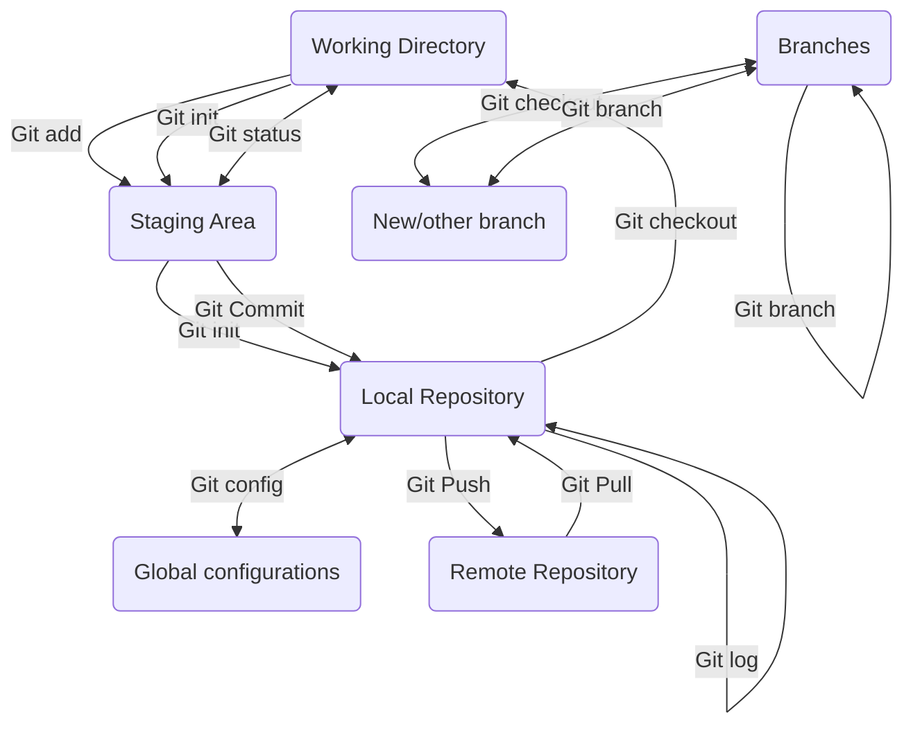

# 10 Most important Git Commands when working locally
* ### Git init
    Initialize new Git monitorer, always the first step. ```git init```
    
    [Link to official refrence documentation](https://www.git-scm.com/docs/git-init)

* ### Git status 
    Check status of current monitored repo. See if changes have been staged and which files have been altered. ```git status```

    [Link to official refrence documentation](https://www.git-scm.com/docs/git-status)

* ### Git commit 
    Saves staged changes, along with a short description to the local repository. ```git commit```

    [Link to official refrence documentation](https://www.git-scm.com/docs/git-commit)

* ### Git version
    Checks your current version of git. ```git version```

    [Link to official refrence documentation](https://www.git-scm.com/docs/git-version)

* ### Git log
    List the version history for current branch or file, and shows commits logs. 
    For branch history ```git log``` and for file history ```git log -follow <file name>```

    [Link to official refrence documentation](https://www.git-scm.com/docs/git-log)

* ### Git add
    It stages a change to be included in your next commit. ```git add```

    [Link to official refrence documentation](https://www.git-scm.com/docs/git-add)

* ### Git checkout 
    Used to switch from one branch to another, or to reset a file to a historic version in the working tree. Can also be used to create a new branch and switch to it. For switching between branches ```git checkout``` and for creating and switching to a new branch ```git checkout -b```

    [Link to official refrence documentation](https://www.git-scm.com/docs/git-checkout) 

* ### Git branch
    Used to list local branches in current repo. Can also be used to create and delete branches. For listing local branches in repo ```git branch```, for creating a branch ```git branch <branch name>``` and for deleting a branch ```git branch -d <branch name>```

    [Link to official refrence documentation](https://www.git-scm.com/docs/git-branch)

* ### Git config
    Set configuration values locally or globaly for repos. ```git config```

    [Link to official refrence documentation](https://www.git-scm.com/docs/git-config)

* ### Git diff 
    See the file differences which are not yet staged. See the file differences between the files in the staging area and the latest version present. To see differences which are not staged ```git diff``` 

    [Link to official refrence documentation](https://www.git-scm.com/docs/git-diff)

